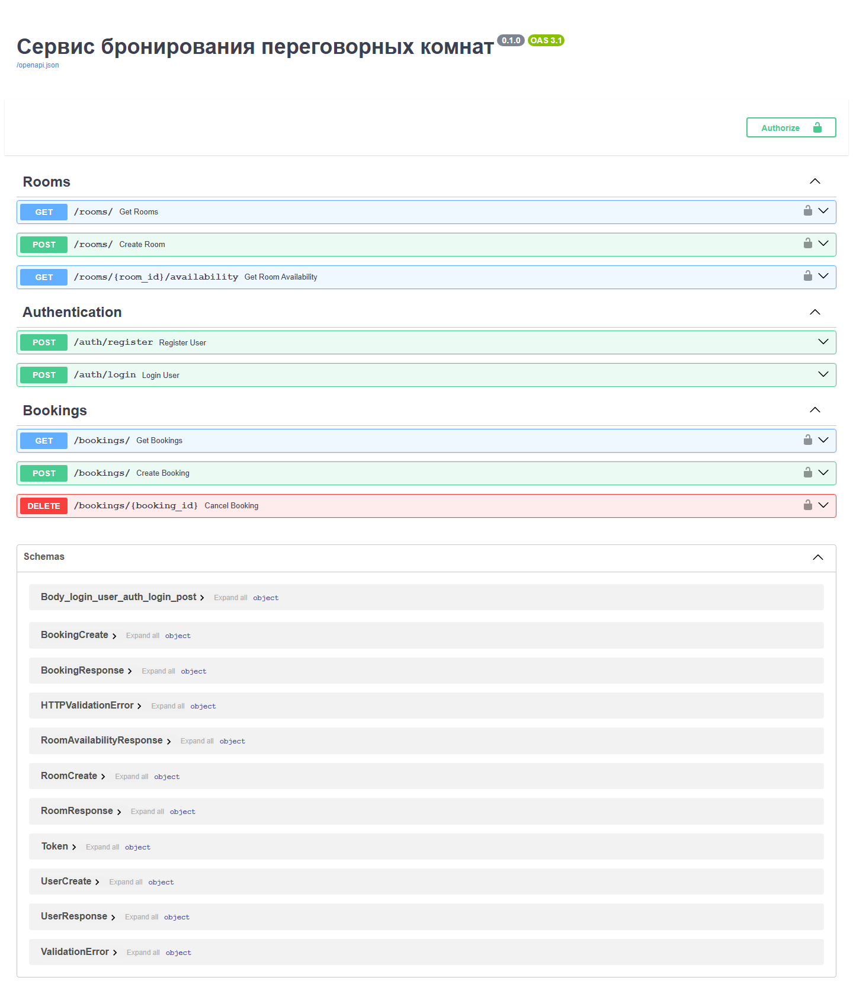
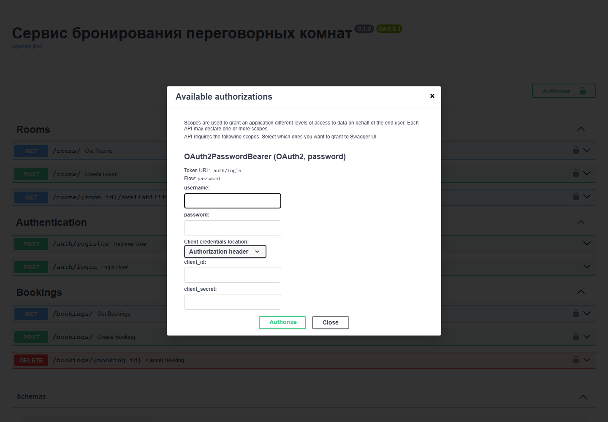
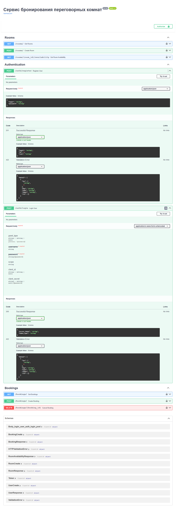
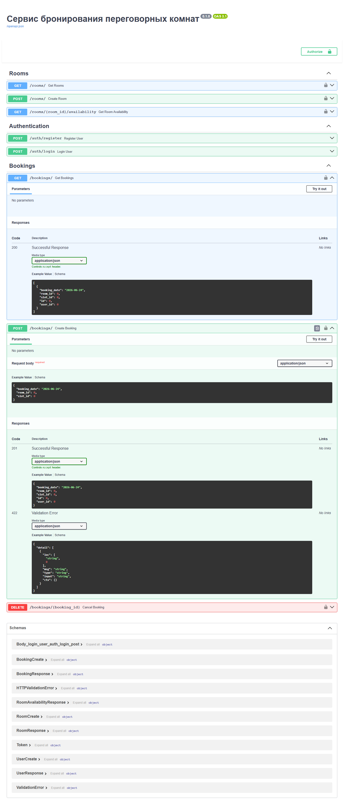

# 🗓️ Сервис бронирования переговорных комнат

REST API для автоматизации бронирования переговорных комнат в коворкинге.
Сотрудники видят занятость комнат на конкретную дату, бронируют и отменяют **свои**
брони; администраторы дополнительно могут отменять **любые** брони и заводить комнаты.

Сервис написан на **FastAPI** с асинхронным **SQLAlchemy 2.0** поверх **PostgreSQL**,
аутентификация — через **JWT**, всё упаковано в **Docker**.

## В цифрах

| Метрика | Значение |
|---|---|
| HTTP-эндпоинты | **8** |
| Тестов (pytest) | **45** в 7 модулях |
| ORM-модели | **4** (User, Room, Slot, Booking) |
| CRUD-классы | **4** |
| Роли доступа | **2** (employee, admin) |
| Дефолтные слоты | **4** (09:00–19:00) |
| Строк кода (app) | **~800** в 27 модулях |
| Python | **3.11+** |

---

## Содержание

- [Возможности](#возможности)
- [Технологический стек](#технологический-стек)
- [Структура проекта](#структура-проекта)
- [Модель данных и бизнес-правила](#модель-данных-и-бизнес-правила)
- [Быстрый старт (Docker Compose)](#быстрый-старт-docker-compose)
- [Запуск локально (Poetry + Uvicorn)](#запуск-локально-poetry--uvicorn)
- [Запуск одним `docker run`](#запуск-одним-docker-run)
- [Переменные окружения](#переменные-окружения)
- [Документация API](#документация-api)
- [Аутентификация и роли](#аутентификация-и-роли)
- [Примеры работы](#примеры-работы)
- [Скриншоты Swagger UI](#скриншоты-swagger-ui)
- [Тесты](#тесты)

---

## Возможности

- 🔐 Регистрация и вход по логину/паролю, выдача JWT с ограниченным сроком жизни.
- 👥 Две роли: **сотрудник** (`employee`) и **администратор** (`admin`).
- 🏢 Просмотр списка комнат и **сетки занятости слотов** на выбранную дату.
- 📌 Создание и отмена бронирований с защитой от двойного бронирования слота
  (на уровне БД — уникальное ограничение + обработка гонки).
- 🛡️ **Изоляция данных**: сотрудник видит и отменяет только свои брони,
  администратор — все.
- 🧱 Чистое разделение на слои: `routers` → `crud` → `models`.
- 🐳 Полная контейнеризация: `Dockerfile` + `docker-compose.yml` (сервис + БД).
- ✅ Покрытие юнит/функциональными тестами на `pytest`.

---

## Технологический стек

| Категория | Технология |
|---|---|
| Язык | Python 3.11+ |
| Веб-фреймворк | FastAPI |
| ORM | SQLAlchemy 2.0 (async) |
| База данных | PostgreSQL (драйвер `asyncpg`) |
| Валидация | Pydantic v2 |
| Аутентификация | JWT (`PyJWT`), хеширование паролей `bcrypt` |
| Управление зависимостями | Poetry |
| Контейнеризация | Docker, Docker Compose |
| Тесты | pytest, pytest-asyncio, httpx |

---

## Структура проекта

```
booking_service/
├── app/
│   ├── core/
│   │   ├── config.py        # настройки из переменных окружения
│   │   ├── constants.py     # роли (ADMIN_ROLE, EMPLOYEE_ROLE)
│   │   ├── init_db.py       # создание админа и дефолтных слотов при старте
│   │   ├── logger.py        # настройка логгера
│   │   └── security.py      # хеширование паролей, выпуск JWT
│   ├── crud/                # слой доступа к данным
│   │   ├── booking.py
│   │   ├── room.py
│   │   ├── slot.py
│   │   └── user.py
│   ├── models/              # ORM-модели SQLAlchemy
│   │   ├── bookings.py
│   │   ├── rooms.py
│   │   ├── slots.py
│   │   └── users.py
│   ├── routers/             # HTTP-эндпоинты
│   │   ├── auth.py
│   │   ├── booking.py
│   │   ├── deps.py          # зависимости (текущий пользователь / админ)
│   │   └── room.py
│   ├── schemas/             # Pydantic-схемы запросов/ответов
│   ├── database.py          # движок, сессии, базовый класс моделей
│   └── main.py              # точка входа, сборка приложения
├── tests/                   # pytest-тесты
├── Dockerfile
├── docker-compose.yml
├── pyproject.toml
├── poetry.lock
└── .env.example
```

---

## Модель данных и бизнес-правила

**Сущности:**

- **User** — пользователь (`login`, `hashed_password`, `role`).
- **Room** — переговорная комната (`name`).
- **Slot** — заранее заданный временной интервал (`start_time`, `end_time`).
- **Booking** — бронирование: связка `room` + `slot` + `booking_date` + `user`.

**Дефолтные временные слоты** (создаются автоматически при первом запуске):

| Слот | Время |
|---|---|
| 1 | 09:00 – 11:00 |
| 2 | 11:00 – 13:00 |
| 3 | 13:00 – 16:00 |
| 4 | 16:00 – 19:00 |

**Ключевые правила:**

- Уникальность брони гарантируется ограничением БД `UNIQUE (room_id, slot_id, booking_date)` —
  один слот в комнате на дату нельзя забронировать дважды.
- При попытке занять уже занятый слот сервис возвращает `409 Conflict`.
- Новый пользователь через `/auth/register` всегда получает роль `employee`.
- Администратор создаётся автоматически при старте из переменных `ADMIN_LOGIN` /
  `ADMIN_HASHED_PASSWORD`.

---

## Быстрый старт (Docker Compose)

Самый простой способ — поднять сервис вместе с базой одной командой.

**1. Создайте файл `.env`** в корне проекта (на основе [`.env.example`](.env.example)):

```dotenv
# PostgreSQL
POSTGRES_USER=postgres
POSTGRES_PASSWORD=my_secret_password
POSTGRES_DB=booking_db
POSTGRES_HOST=localhost
POSTGRES_PORT=5432

# JWT
SECRET_KEY=замените_на_случайную_строку_32+_байта
ALGORITHM=HS256
ACCESS_TOKEN_EXPIRE_MINUTES=60

# Администратор (значение в ОДИНАРНЫХ кавычках — см. примечание ниже!)
ADMIN_LOGIN=admin
ADMIN_HASHED_PASSWORD='$2b$12$EixZaYVK1fsbw1ZfbX3OXePaWxn96p36WQoeG6Lruj3vjPGga31tG'
```

> ⚠️ **Важно:** `ADMIN_HASHED_PASSWORD` — это **bcrypt-хеш**, а не пароль в открытом виде.
> Значение нужно брать **в одинарных кавычках**, иначе Docker Compose воспримет символы
> `$` как переменные и испортит хеш. Как сгенерировать хеш — см.
> [Переменные окружения](#переменные-окружения).

**2. Запустите:**

```bash
docker compose up --build -d
```

**3. Откройте документацию:**

- Swagger UI: <http://localhost:8000/docs>
- ReDoc: <http://localhost:8000/redoc>

**Остановить:**

```bash
docker compose down          # остановить, данные сохранятся
docker compose down -v       # остановить и удалить данные (volume)
```

---

## Запуск локально (Poetry + Uvicorn)

Требуется установленный **Python 3.11+**, **Poetry** и запущенный **PostgreSQL**.

```bash
# 1. Установить зависимости
poetry install

# 2. Создать .env (см. раздел выше). Для локального запуска
#    POSTGRES_HOST=localhost

# 3. Запустить сервер
poetry run uvicorn app.main:app --reload
```

При старте приложение само создаёт таблицы, администратора и дефолтные слоты.
Документация: <http://localhost:8000/docs>

---

## Запуск одним `docker run`

Если база поднимается отдельно, можно собрать и запустить только сервис:

```bash
# Собрать образ
docker build -t booking-service .

# Запустить (БД доступна на хосте; внутри контейнера хост — host.docker.internal)
docker run --rm -p 8000:8000 \
  --env-file .env \
  -e POSTGRES_HOST=host.docker.internal \
  booking-service
```

---

## Переменные окружения

| Переменная | Описание | Пример / по умолчанию |
|---|---|---|
| `POSTGRES_USER` | Пользователь PostgreSQL | `postgres` |
| `POSTGRES_PASSWORD` | Пароль PostgreSQL | `my_secret_password` |
| `POSTGRES_DB` | Имя базы данных | `booking_db` |
| `POSTGRES_HOST` | Хост БД (`db` в compose, `localhost` локально) | `localhost` |
| `POSTGRES_PORT` | Порт БД | `5432` |
| `SECRET_KEY` | Секрет для подписи JWT (32+ байта) | `openssl rand -hex 32` |
| `ALGORITHM` | Алгоритм подписи JWT | `HS256` |
| `ACCESS_TOKEN_EXPIRE_MINUTES` | Время жизни токена, мин. | `60` |
| `ADMIN_LOGIN` | Логин дефолтного администратора | `admin` |
| `ADMIN_HASHED_PASSWORD` | **bcrypt-хеш** пароля админа (в кавычках!) | `'$2b$12$...'` |

**Как сгенерировать `ADMIN_HASHED_PASSWORD`:**

```bash
python -c "import bcrypt; print(bcrypt.hashpw(b'мой_пароль', bcrypt.gensalt()).decode())"
```

Полученную строку (начинается с `$2b$`) вставьте в `.env` **в одинарных кавычках**.
Затем для входа админом используйте исходный пароль (`мой_пароль`).

---

## Документация API

Базовый префикс отсутствует, интерактивная документация доступна на `/docs`.

| Метод | Путь | Доступ | Описание |
|---|---|---|---|
| `POST` | `/auth/register` | публично | Регистрация сотрудника |
| `POST` | `/auth/login` | публично | Получение JWT по логину/паролю |
| `GET` | `/rooms/` | авторизованные | Список всех комнат |
| `POST` | `/rooms/` | **только admin** | Создать комнату |
| `GET` | `/rooms/{room_id}/availability` | авторизованные | Занятость слотов на дату |
| `POST` | `/bookings/` | авторизованные | Создать бронь |
| `GET` | `/bookings/` | авторизованные | Свои брони (admin — все) |
| `DELETE` | `/bookings/{booking_id}` | владелец брони или admin | Отменить бронь |

### Коды ответов

| Код | Когда |
|---|---|
| `200 OK` | Успешный GET / login |
| `201 Created` | Создан пользователь / комната / бронь |
| `204 No Content` | Бронь успешно отменена |
| `400 Bad Request` | Логин уже занят |
| `401 Unauthorized` | Нет/невалидный токен, неверные логин-пароль |
| `403 Forbidden` | Недостаточно прав (чужая бронь / не админ) |
| `404 Not Found` | Комната / слот / бронь не найдены |
| `409 Conflict` | Слот в комнате на дату уже занят |

---

## Аутентификация и роли

Используется схема **OAuth2 Password Flow** с Bearer-токеном (JWT).

1. Получите токен через `POST /auth/login` (тело — `form-data`: `username`, `password`).
2. Передавайте его в заголовке: `Authorization: Bearer <access_token>`.

Токен содержит логин (`sub`), роль (`role`) и срок действия (`exp`).
В Swagger UI нажмите кнопку **Authorize** и введите логин/пароль — токен подставится автоматически.

| Действие | Сотрудник | Администратор |
|---|---|---|
| Смотреть комнаты и доступность | ✅ | ✅ |
| Создавать свои брони | ✅ | ✅ |
| Видеть/отменять **свои** брони | ✅ | ✅ |
| Видеть **все** брони | ❌ | ✅ |
| Отменять **любые** брони | ❌ | ✅ |
| Создавать комнаты | ❌ | ✅ |

---

## Примеры работы

> Примеры в формате `curl` (Bash). В PowerShell используйте `curl.exe` или Invoke-RestMethod.
> Базовый адрес — `http://localhost:8000`.

### 1. Регистрация сотрудника

```bash
curl -X POST http://localhost:8000/auth/register \
  -H "Content-Type: application/json" \
  -d '{"login": "alice", "password": "alice_pass"}'
```

```json
{ "login": "alice", "id": 2, "role": "employee" }
```

### 2. Вход и получение токена

```bash
curl -X POST http://localhost:8000/auth/login \
  -H "Content-Type: application/x-www-form-urlencoded" \
  -d "username=alice&password=alice_pass"
```

```json
{ "access_token": "eyJhbGciOiJIUzI1NiIsInR5cCI6IkpXVCJ9...", "token_type": "bearer" }
```

Сохраним токен в переменную для удобства:

```bash
TOKEN="eyJhbGciOiJIUzI1NiIsInR5cCI6IkpXVCJ9..."
```

### 3. Создание комнаты (только администратор)

```bash
curl -X POST http://localhost:8000/rooms/ \
  -H "Authorization: Bearer $ADMIN_TOKEN" \
  -H "Content-Type: application/json" \
  -d '{"name": "Переговорная А"}'
```

```json
{ "name": "Переговорная А", "id": 1 }
```

### 4. Просмотр занятости комнаты на дату

```bash
curl "http://localhost:8000/rooms/1/availability?booking_date=2026-07-01" \
  -H "Authorization: Bearer $TOKEN"
```

```json
[
  { "slot_id": 1, "start_time": "09:00:00", "end_time": "11:00:00", "is_free": true },
  { "slot_id": 2, "start_time": "11:00:00", "end_time": "13:00:00", "is_free": true },
  { "slot_id": 3, "start_time": "13:00:00", "end_time": "16:00:00", "is_free": true },
  { "slot_id": 4, "start_time": "16:00:00", "end_time": "19:00:00", "is_free": true }
]
```

### 5. Создание брони

```bash
curl -X POST http://localhost:8000/bookings/ \
  -H "Authorization: Bearer $TOKEN" \
  -H "Content-Type: application/json" \
  -d '{"room_id": 1, "slot_id": 1, "booking_date": "2026-07-01"}'
```

```json
{ "booking_date": "2026-07-01", "room_id": 1, "slot_id": 1, "id": 1, "user_id": 2 }
```

Повторная попытка занять тот же слот вернёт `409 Conflict`:

```json
{ "detail": "Этот временной слот в выбранной комнате уже забронирован на указанную дату" }
```

### 6. Просмотр своих броней

```bash
curl http://localhost:8000/bookings/ -H "Authorization: Bearer $TOKEN"
```

```json
[ { "booking_date": "2026-07-01", "room_id": 1, "slot_id": 1, "id": 1, "user_id": 2 } ]
```

### 7. Отмена брони

```bash
curl -X DELETE http://localhost:8000/bookings/1 \
  -H "Authorization: Bearer $TOKEN"
```

Ответ: `204 No Content`. Попытка отменить чужую бронь (не будучи админом) — `403 Forbidden`.

---

## Скриншоты Swagger UI

> 📸 Раздел с иллюстрациями работы сервиса. Скриншоты со страницы
> <http://localhost:8000/docs>. Файлы лежат в [`docs/screenshots/`](docs/screenshots/).

### Общий вид Swagger UI

Все эндпоинты сгруппированы по тегам (Rooms, Authentication, Bookings) и схемы данных.



### Авторизация (кнопка Authorize)

Ввод логина/пароля — токен подставляется в запросы автоматически.



### Регистрация и логин

Тела запросов и схемы ответов для `POST /auth/register` и `POST /auth/login`.



### Эндпоинты бронирования

Создание, просмотр и отмена броней (`/bookings/`).



---

## Тесты

**45 тестов**. Тесты написаны на `pytest` и выполняются на
изолированной in-memory SQLite БД (без внешних зависимостей). Покрыты слой безопасности,
CRUD и HTTP-эндпоинты, включая проверку **прав доступа** и **изоляции данных** пользователей.

```bash
# Установить зависимости вместе с dev-группой
poetry install --with dev

# Запустить все тесты
poetry run pytest

# С подробным выводом
poetry run pytest -v

# С отчётом о покрытии
poetry run pytest --cov=app --cov-report=term-missing
```

Состав (7 модулей, 45 тестов):

| Файл | Тестов | Что проверяет |
|---|:---:|---|
| `tests/test_security.py` | 7 | хеширование паролей, выпуск и валидация JWT |
| `tests/test_crud_user.py` | 4 | создание пользователя, поиск по логину |
| `tests/test_crud_room.py` | 6 | комнаты и расчёт занятости слотов |
| `tests/test_crud_booking.py` | 6 | создание брони, конфликт слота, изоляция по пользователю |
| `tests/test_auth_api.py` | 5 | регистрация и логин через HTTP |
| `tests/test_rooms_api.py` | 6 | права на создание комнат, availability |
| `tests/test_bookings_api.py` | 11 | полный цикл броней, права и изоляция данных |
| **Итого** | **45** | покрытие **92%** |

По слоям: **7** тестов безопасности, **16** на CRUD, **22** на HTTP-эндпоинты.

---

<p align="center">Создано в рамках выполнения тестового задания курса <b>ШИФТ</b> · Python</p>
